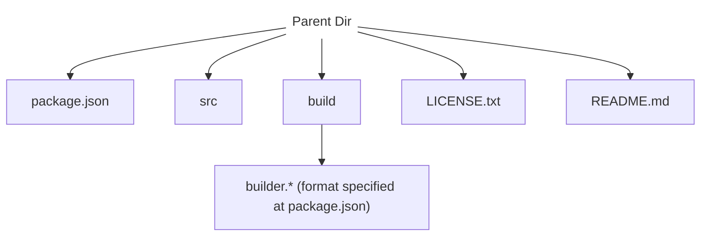

# ConduitPkg Documentation

## Structure of a packet

```mermaid
---
config:
  layout: dagre
---
flowchart TD
    n1["Parent Dir"] --> n2["package.json"] & n3["src"] & n4["build"] & n5["LICENSE.txt"] & n6["README.md"]
    n4 --> n9["builder.* (format specified at package.json)"]
    n1@{ shape: text}
```