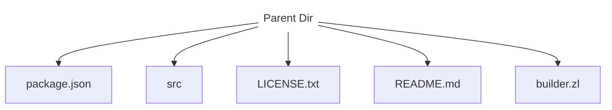
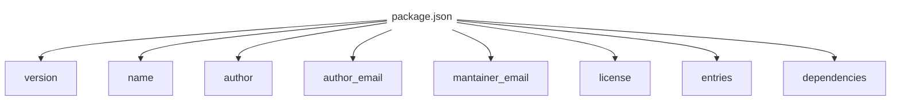

# ConduitPkg Documentation

## Structure of a packet



### In ```package.json```



## API Documentation

|Function|Purpose|
|-|-|
|```conduitpkg.api.advanced.install_pkg(name, local=False, protocol="http")```|Install a package at local or global env|
|```conduitpkg.api.advanced.run_entry(name, local=False)```|Run an entry from local or global env|
|```conduitpkg.api.advanced.advanced_install(name, protocol="http")```|Install a package globally|
|```conduitpkg.api.advanced.local_advanced_install(name, protocol="http")```|Install a package locally|
|```conduitpkg.api.advanced.exec_entry(command)```|Run a global entry|
|```conduitpkg.api.advanced.local_exec_entry(command)```|Run a local entry|
|```conduitpkg.api.advanced.compress(dir)```|Compress a folder to a conduit packet|
|```conduitpkg.api.advanced.extract(name, local=False, zipped=True)```|Extract a packet|
|```conduitpkg.api.advanced.post_install(local=True)```|Run postinstall|
|```conduitpkg.api.advanced.init_pkg(name)```|Initializes a packet|
|```conduitpkg.api.advanced.add_repo(name, local=False)```|Adds a repo to the list|
|```conduitpkg.api.advanced.remove_repo(name, local=False)```|Removes a repo from the list|
|```conduitpkg.api.advanced.get_repos(local=False)```|Return the list of repos|
|```conduitpkg.api.advanced.uninstall_pkg(name, local=False)```|Uninstall a packet|
|```conduitpkg.api.advanced.print_pkg_info(pkg, local=False)```|Prints info of a package|
|```conduitpkg.api.advanced.list_pkgs(local=False)```|Prints the list of installed packages|
### Examples

```python
from conduitpkg.api import advanced as cpkg

cpkg.post_install() # adds a local env for ConduitPkg
```
