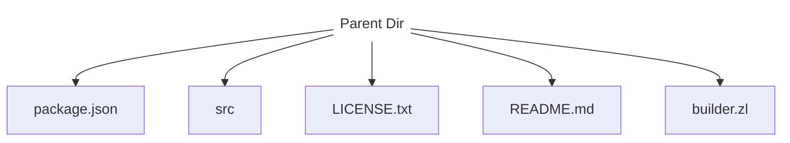
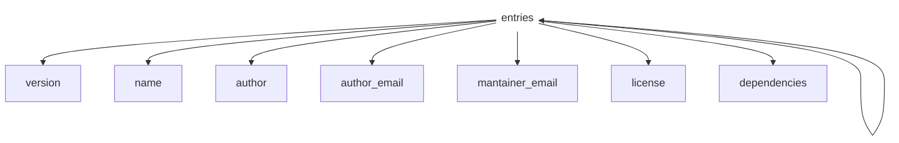

# ConduitPkg Documentation

## Structure of a packet


```mermaid
---
config:
  layout: dagre
---
flowchart TD
    n1["Parent Dir"] --> n2["package.json"] & n3["src"] & n5["LICENSE.txt"] & n6["README.md"] & n9["builder.zl"]
    n1@{ shape: text}
```

### In ```package.json```


```mermaid
---
config:
  layout: dagre
---
flowchart TD
    n1["package.json"] --> n4["version"] & n5["name"] & n6["author"] & n7["author_email"] & n8["mantainer_email"] & n9["license"] & n1["entries"] & n2["dependencies"]
    n1@{ shape: text}
```